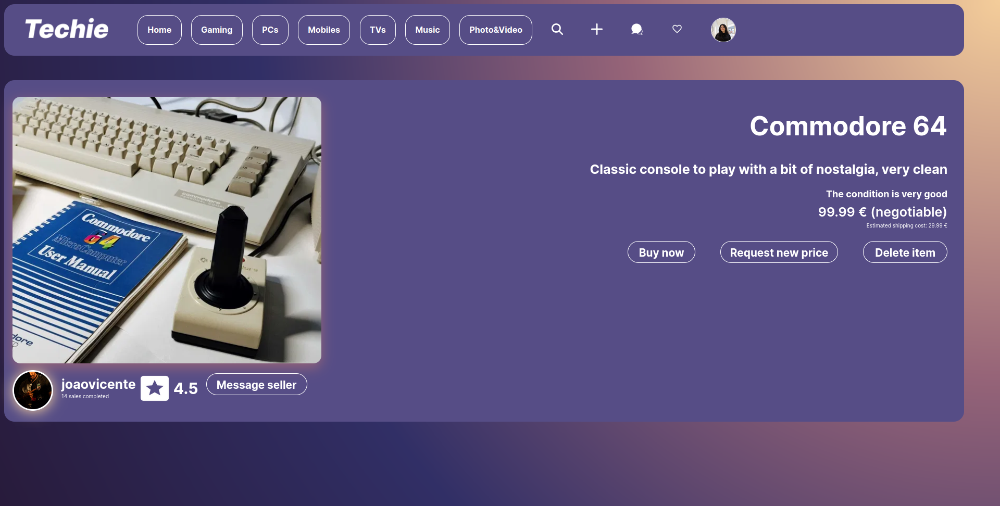

# Techie - Second Hand Electronics Marketplace

## Group ltw18g01

- Clara Sousa (up202207582) 33%

- João Mendes (up202208586) 33%

- Miguel Moita (up202207678) 33%

## Install Instructions

    git@github.com:FEUP-LTW-2024/ltw-project-2024-ltw18g01.git

    git checkout final-delivery-v1

    sqlite db/database.db < db/database.sql

    php -S localhost:9000

## Screenshots

## Implemented Features

**General**:

- [X] Register a new account.

- [X] Log in and out.

- [X] Edit their profile, including their name, username, password, email and image.

**Sellers**  should be able to:

- [X] List new items, providing title, category, subcategory, model, size, and condition, along with images.

- [X] Track and manage their listed items.

- [X] Respond to inquiries from buyers regarding their items and add further information if needed.

- [X] Print shipping forms for items that have been sold. (with real barcode)

**Buyers**  should be able to:

- [X] Browse items using filters like category, price, and condition.

- [X] Engage with sellers to ask questions or negotiate prices.

- [X] Add items to a wishlist or shopping cart.

- [X] Proceed to checkout with their shopping cart (simulate payment process).

**Admins**  should be able to:

- [X] Elevate a user to admin status.

- [X] Introduce new item categories, sizes, conditions, and other pertinent entities.

- [X] Oversee and ensure the smooth operation of the entire system.

**Security**:

We have been careful with the following security aspects:

- [X] **SQL injection**

- [ ] **Cross-Site Scripting (XSS)**

- [ ] **Cross-Site Request Forgery (CSRF)**

**Password Storage Mechanism**: hash_password & verify_password (salting techniques)

**Aditional Requirements**:

We also implemented the following additional requirements (you can add more):

- [ ] **Rating and Review System**

- [ ] **Promotional Features**

- [ ] **Analytics Dashboard**

- [ ] **Multi-Currency Support**

- [ ] **Item Swapping**

- [ ] **API Integration**

- [ ] **Dynamic Promotions**

- [ ] **User Preferences**

- [X] **Shipping Costs** - Shipping cost changes with the size of the item.

- [X] **Real-Time Messaging System** - You can talk to a member to negotiate prices and discuss the deal's terms.

- [X] **Negotiable** - You can only negotiate prices if the seller defines the item is negotiable.
      
- [X] **Mobile optimization** - Website is fully functional on mobile, with specific-features like scrollable lists.
